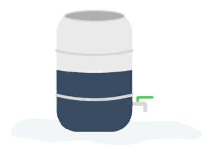
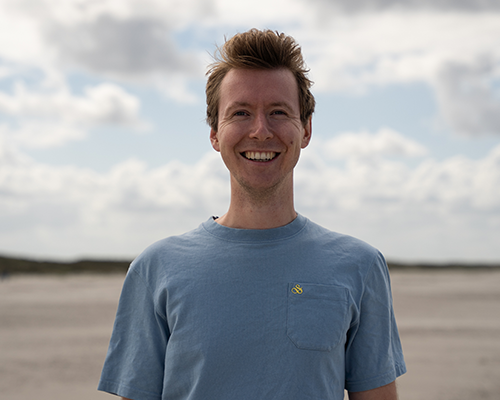

## Over SPATwater

SPATwater bestaat uit een nieuwe generatie enthousiaste hydrologen die met een technische achtergrond nét wat anders kijken naar ruimtelijke opgaven. De uitdagingen zijn enorm, maar de kansen die het biedt nog groter.

Met expertise op het gebied van waterkwaliteit, de Kaderrichtlijn Water en klimaatadaptatie helpt SPATwater overheden en bedrijven om toekomstbestendig en waterrobuust te worden.

Wij voeren geen analyse uit zonder handelingsperspectief en bieden zowel creatieve als praktische oplossingen.

## Expertise

<section
  class="expertise section">
  

    

      

### Klimaatadaptatie

  <a href="#klimaat" class="button">
        
Meer informatie

      </a>
    

      

### Waterkwaliteit

      <a href="#waterkwaliteit" class="button">
        
Meer informatie

      </a>
    

      

### B-Rain

  <a href="#brain" class="button">
        
Meer informatie

      </a>
    

  

</section>

## Klimaatadaptatie

<b>Als meer dan 60% van een gemeente private grond is… dan is het noodzakelijk om deze grond klimaatadaptief te maken.</b>

Ons vertrekpunt is dat een groot deel van een gemeente
bestaat uit private grond (tuinen, daken, bedrijventerreinen) en dat het absoluut noodzakelijk is dat deze private ruimte klimaatadaptief ingericht moet worden. Elk perceel vraagt om maatwerk, maar het is onmogelijk om elke tuin in te gaan.

- Hoe los jed it probleem op ?
- Hoe zet je subsidiestomen efficiënt in?
- Hoe activeer je bewoners?

## Gemeenten

<b>Wij kunnen elke bewoner in uw gemeente een persoonlijk klimaatadaptief advies geven zonder elke tuin in te gaan.</b>>

Wij gebruiken ruimtelijke data en sociale kennis uit de buurt om de gemeente gedetailleerd in kaart te brengen. In combinatie met veldwerk kunnen wij op postcode, buurt of wijkniveau klimaatadaptieve maatregelen personaliseren en prioriteren in de private ruimte. Hiermee maken wij de private ruimte waterrobuust, waterveilig, hitte- en droogtebestendig.

## Bedrijventerreinen

Bedrijventerreinen zijn vaak versteend, privaat terrein met veel oppervlakte. Er liggen enorme uitdagingen maar vooral kansen om deze terreinen klimaatbestendig in te richten en de werkomgeving te verbeteren.

SPATwater richt zich op het activeren van werknemers en bedrijven door vraag en aanbod op het gebied van water bij elkaar te brengen door middel van ruimtelijke data en geeft handvatten om bedrijventerreinen te vergroenen.

Hoe doen wij dit?

- Het uitvoeren van stakeholder/netwerk analyses
- Co-creatie sessies organiseren
- Het uitvoeren van restwaterscans
- Het uitvoeren van klimaatanalyses en het koppelen van relevante maatregelen

## Waterkwaliteit

<b>Wat betekent de Kaderrichtlijn Water voor jou?</b>

De Kaderrichtlijn Water (KRW) is een Europese richtlijn die regelt dat oppervlaktewateren en het grondwater van voldoende kwaliteit zijn. Toch voldoen pas enkele wateren aan deze norm. We staan nu op een keerpunt. Binnen 5 jaar, in 2027, moeten alle oppervlaktewateren en ons grondwater voldoen aan de KRW. Vergelijkingen met de stikstofcrisis zijn snel gemaakt, maar de KRW biedt ook kansen in proposities, aanbestedingen en vergunningverlening.

SPATwater biedt hulp aan organisaties bij het identificeren van de implicaties van de KRW voor hun specifieke situatie. Dit doen wij onder andere door middel van:

- Het verzorgen van kennissessies
- Analyse van huidige KRW-risico’s en kansen
- Propositieverbetering

## b-RAIN

<b>b-RAIN is het project rondom het koppelen van weerberichten aan wateropvang/gebruik in de tuin.</b>

Weersextremen in Nederland nemen steeds verder toe. Enerzijds komen in periodes van droogte, watertekorten vaker voor en anderzijds hebben we vaker te maken met extreme neerslag, met wateroverlast tot gevolg.

B-rain wil bewoners positief betrokken houden bij het bufferen van regenwater en het groen houden van hun tuin. Door enkele gegevens in een app aan te geven, geeft deze app terug wanneer de regenwaterbuffer vol zit, wanneer deze geleegd moet worden (als er bijvoorbeeld een grote regenbui aan komt) en wanneer het lang niet regent (waardoor je zoveel mogelijk water in de regenwaterbuffer wil vasthouden).

Bekijk project

## Projecten

## Kennisbank

## Team

